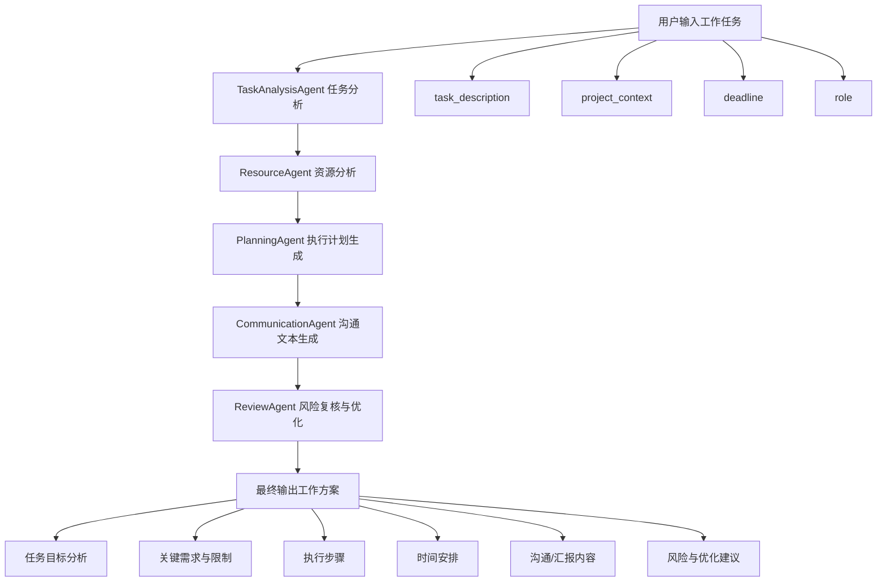

# WorkAgent-MultiAgent

基于 LangGraph 的多智能体职场任务处理助手，聚焦日常职场任务的分析、拆解、计划、沟通和风险复核。
本项目参考自[JobAgent-MultiAgent](https://github.com/connwang7/JobAgent-MultiAgent)项目

## 功能流程



## Agent 分工

| Agent | 职责 |
| --- | --- |
| Supervisor | 负责调度多智能体流程 |
| TaskAnalysisAgent | 分析任务目标、交付物、限制条件和成功标准 |
| ResourceAgent | 梳理已有资源、资源缺口、依赖方和补充信息 |
| PlanningAgent | 生成执行步骤、时间安排、优先级和里程碑 |
| CommunicationAgent | 生成汇报摘要、协作请求、风险同步等沟通文本 |
| ReviewAgent | 复核风险并整合最终职场任务处理方案 |

## 环境要求

- Python 3.8+
- pip
- DeepSeek 或其他 OpenAI-compatible 模型服务

## 安装与启动

推荐直接使用启动脚本，它会自动创建/使用 `.venv`、安装缺失依赖并启动服务，不需要手动进入虚拟环境：

```powershell
.\run_local.ps1
```

也可以在 Windows 文件管理器中双击：

```text
start.bat
```

如需手动启动，可执行：

```powershell
cd .\WorkAgent-MultiAgent
python -m venv .venv
.\.venv\Scripts\Activate.ps1
pip install -r requirements.txt
streamlit run app.py
```

启动后访问：

```text
http://localhost:8501
```

关闭浏览器页面只会断开前端连接，不会停止本地 Streamlit 服务。停止项目运行可使用以下任一方式：

- 在应用侧边栏点击“停止本地服务”
- 回到启动项目的 PowerShell/命令行窗口，按 `Ctrl+C`

## 环境变量

仓库中只保留 [.env.example](./.env.example)，真实 `.env` 不应提交到 GitHub。

DeepSeek 推荐配置：

```env
MODEL_NAME=deepseek-chat
OPENAI_API_KEY=
OPENAI_BASE_URL=https://api.deepseek.com/v1

DEEPSEEK_API_KEY=
DEEPSEEK_BASE_URL=https://api.deepseek.com/v1
```

当前主流程不依赖搜索和网页抓取。以下字段仅在后续需要联网资料核验、竞品调研、政策查询或 URL 摘要时填写：

```env
SERPER_API_KEY=
FIRECRAWL_API_KEY=
```

## .env 加密与恢复

本项目使用 Windows DPAPI 对本机 `.env` 做加密备份。加密文件只能由当前 Windows 用户在当前环境中恢复，不建议作为跨机器共享密钥方案。

加密当前 `.env`：

```powershell
.\scripts\encrypt_env.ps1
```

恢复 `.env`：

```powershell
.\scripts\decrypt_env.ps1
```

加密产物位于：

```text
config/env.local.dpapi
```

该文件已加入 `.gitignore`，默认不上传 GitHub。

## 项目结构

```text
.
├── app.py                     # Streamlit 应用入口
├── agents.py                  # LangGraph 多智能体节点与流程
├── chains.py                  # Supervisor 路由链
├── prompts.py                 # Agent 提示词与最终输出模板
├── members.py                 # Agent 成员定义
├── schemas.py                 # 输入和路由数据结构
├── llms.py                    # 模型初始化
├── custom_callback_handler.py # Agent 执行过程展示
├── run_local.ps1              # Windows PowerShell 启动脚本
├── run_local.bat              # Windows 双击启动脚本
├── start.bat                  # 简化启动入口，双击即可启动
├── scripts/                   # .env 加密与恢复脚本
├── config/                    # 本地加密配置目录，默认不提交敏感文件
├── requirements.txt           # Python 依赖
└── .env.example               # 环境变量模板
```

## 后续扩展

当前版本专注职场任务处理，不包含旧场景资源和联网抓取工具。后续如需增加联网资料核验、网页摘要、竞品调研或文档导出功能，可在新的工具模块中按当前主题重新实现。
